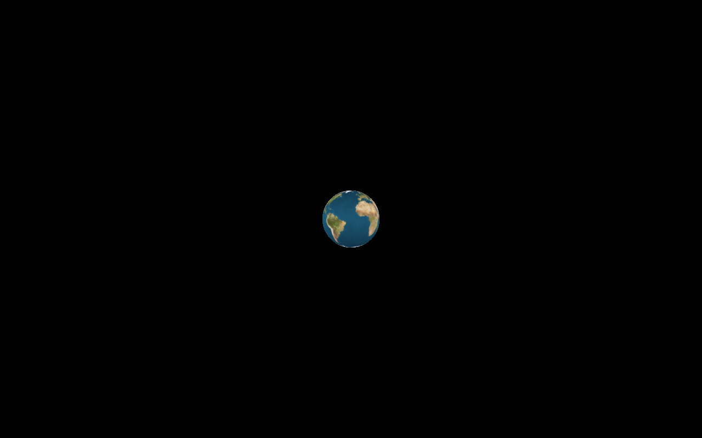

# 3D Globe Earth

Interactive Earth globe in JavaScript — drag to orbit.



**Live demo:** [https://rogue-dev-studio.github.io/3d-globe-earth-with-javascript/](https://rogue-dev-studio.github.io/3d-globe-earth-with-javascript/)

## Highlights
- WebGL / JS globe
- Mouse / touch orbit

## Run
Open `index.html` locally (Live Server on port **5500**), or use the live demo above.

```bash
git clone https://github.com/rogue-dev-studio/3d-globe-earth-with-javascript.git
```

By [Aris Hadisopiyan](https://rogue-dev-studio.github.io/) / Rogue Dev Studio.

MIT
